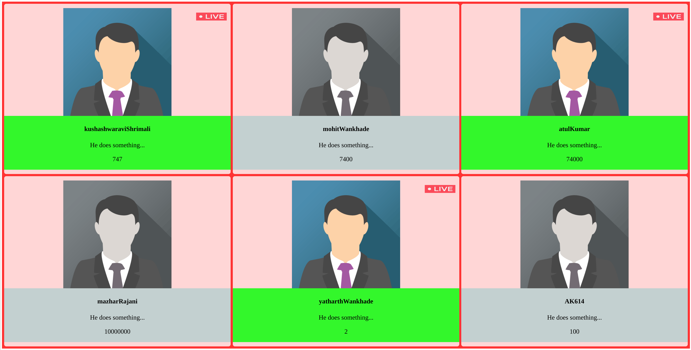

## YouTube Monitoring App

**Goals:**

1. Have an app which gives you an option to select your favorite streamers.
2. The app will show you live details of the streamer:
  * Is he live?
  * When was he live the last time?
  * Subscriber count?
  * Description, username, name...
  * Title of the stream
and more...

### Current Progress

Fill the JSON with the data, and auto-generate the HTML.

